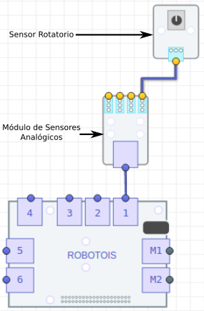

# Primeros Pasos con el Sensor Rotatorio
El Sensor Rotatorio es un sensor analógico, es decir que éste proporciona una señal (voltaje) proporcional a la posición a la que se encuentra la perilla. Por lo anterior, este módulo debe usarse en combinación con el módulo de Sensores Analógicos, ya que éste cuenta con el componente **ADC** (*Analog Digital Converter*), y a través de éste se obtienen mediciones numéricas.

Es bien sabido que la *Raspberry PI* no cuenta con módulos ADC, por ello es importante usar el módulo de Sensores Analógicos. La comunicación del módulo de Sensores Analógicos con la PI se realiza a través del puerto **IIC**, por lo cual no es necesario especificar el puerto del **Shield** al cual se conecta. Sin embargo, solo se pueden usar los puertos genéricos `1-6`, ya que los puertos `M1-M2` son designados para motores.

Por otro lado, para el Sensor Rotatorio se debe especificar a cuál puerto analógico (del módulo de Sensores Analógicos) se va a conectar, ya que este parámetro es requerido para tomar las mediciones adecuadamente.

## Instalación de la librería

Al igual que todas las librerías de **Robotois**, esta librería se puede instalar a través del paquete en [**npm**](https://www.npmjs.com/package/robotois-rotary-sensor) o el repositorio de [**GitHub**](https://github.com/Robotois/robotois-rotary-sensor):

* Usando el gestor **npm** la librería se instala de la siguiente manera:
```shell
npm install --save https://github.com/Robotois/robotois-rotary-sensor.git
```

* Para instalar desde el repositorio de **GitHub**, se puede descargar el repositorio, pero se recomienda lo siguiente:
```shell
npm install --save git+https://github.com/Robotois/robotois-rotary-sensor.git
```

## Conexión al Shield
La conexión al **Shield** se realiza como se ilustra en la siguiente imagen, en donde se observa que el Sensor Rotatorio se conecta en uno de los puertos analógicos del Módulo de Sensores Analógicos y éste a su vez se conecta al Shield en uno de los puertos genéricos.



## Obtener mediciones
Con esta librería se pueden obtener las mediciones del Sensor Rotatorio de manera sencilla, en la cual se utilizan eventos. Es decir, que cada vez que está disponible una medición nueva, se dispara un evento con un valor proporcional a la posición que se encuentra la perilla del Sensor Rotatorio. En este caso, los valores de las mediciones están en un rango de `0-10`, en donde el valor `0` indica que la perilla se encuentra en la posición más baja y el valor `10` indica que la perilla se encuentra en la posición máxima.

Otros aspectos importantes de la medición por eventos son los siguientes, las valores numéricos son valores enteros y el tiempo de muestreo es de `250ms`. Se debe tener en consideración esta información, ya que si la aplicación que se va a desarrollar requiere de un mejor tiempo de muestreo o se requieren mediciones más precisas, entonces probablemente es mejor usar otro de los métodos de los que cuenta esta librería, para obtener las mediciones.

Un ejemplo de cómo utilizar las mediciones por eventos es el siguiente:

```javascript
const RotarySensor = require('robotois-rotary-sensor');

const rotary = new RotarySensor(1);

rotary.enableEvents();

rotary.on('medicion', (value) => {
  console.log(`Posicion: ${value}`);
});
```
En el ejemplo anterior, se observa que para habilitar las mediciones por eventos se debe ejecutar la función `enableEvents()`. El resultado de ejecutar el ejemplo anterior, puede ser el siguiente:

```text
Posicion: 0
Posicion: 2
Posicion: 4
Posicion: 5
Posicion: 7
Posicion: 9
Posicion: 10
Posicion: 10
Posicion: 10
Posicion: 7
Posicion: 5
Posicion: 4
Posicion: 2
Posicion: 2
Posicion: 1
Posicion: 0
```

Como se puede observar, en el resultado anterior se tienen los valores de las mediciones cuando se hace girar la perilla del Sensor Rotatorio de la posición mínima a la posición máxima, y viceversa.

## Función `when()`

También se cuenta con la función `when()`, la cual permite realizar una acción con base en la posición actual de la perilla del Sensor Rotatorio. Lo que quiere decir que es posible programar una tarea para cuando la perilla se encuentra en una posición específica. En el siguiente ejemplo se muestra cómo utilizar esta función:

```javascript
const RotarySensor = require('robotois-rotary-sensor');

const rotary = new RotarySensor(1);

rotary.when(5, () => {
  console.log('Wow, la posicion es 5!!');
});
```
Como se observa, en el ejemplo anterior no es necesario ejecutar explíticamente la función `enableEvents()`, ya que de manera interna, en la función `when()` se realiza dicha invocación. El resultado de ejecutar el ejemplo anterior se muestra a continuación.

```text
Posicion: 0
Posicion: 1
Posicion: 2
Posicion: 4
Posicion: 4
Posicion: 5
Wow, la posicion es 5!!
Posicion: 5
Wow, la posicion es 5!!
Posicion: 5
Wow, la posicion es 5!!
Posicion: 6
Posicion: 7
Posicion: 8
```
